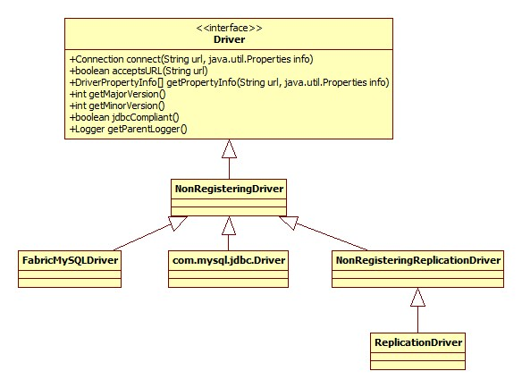
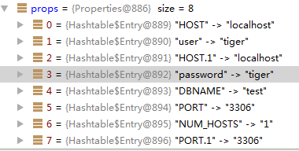

# 连接

我们仍以常用的方式建立数据库连接，如下代码所示:

```java
@Before
public void init() throws ClassNotFoundException, SQLException {
    Class.forName("com.mysql.jdbc.Driver");
    connection = DriverManager.getConnection(
        "jdbc:mysql://localhost:3306/test", "tiger", "tiger");
}
```

## 驱动注册

当mysql驱动类被加载时，会向java.sql.DriverManager进行注册，Driver静态初始化源码:

```java
static {
    java.sql.DriverManager.registerDriver(new Driver());
}
```

DriverManager.registerDriver:

```java
public static synchronized void registerDriver(java.sql.Driver driver,
    DriverAction da) {
    /* Register the driver if it has not already been added to our list */
    if(driver != null) {
        registeredDrivers.addIfAbsent(new DriverInfo(driver, da));
    }
}
```

registeredDrivers其实是一个CopyOnWriteArrayList类型，DriverAction用于当驱动被取消注册时被调用，DriverInfo是DriverManager的内部类，其实就是对Driver和DriverAction对象进行了一次包装，并没有其它的作用。

接下来看一下驱动接口Driver的定义，位于java.sql包下，类图:



DriverManager.getConnection方法调用了NonRegisteringDriver的connect方法:

```java
public java.sql.Connection connect(String url, Properties info) {
    if (url != null) {
        if (StringUtils.startsWithIgnoreCase(url, LOADBALANCE_URL_PREFIX)) {
            return connectLoadBalanced(url, info);
        } else if (StringUtils.startsWithIgnoreCase(url, REPLICATION_URL_PREFIX)) {
            return connectReplicationConnection(url, info);
        }
    }
    Properties props = null;
    if ((props = parseURL(url, info)) == null) {
        return null;
    }
    if (!"1".equals(props.getProperty(NUM_HOSTS_PROPERTY_KEY))) {
        return connectFailover(url, info);
    }
    Connection newConn = com.mysql.jdbc.ConnectionImpl.
        getInstance(host(props), port(props), props, database(props), url);
    return newConn;
}
```

## 建立

从源码中可以看出，系统针对URL的不同采用了不同的连接策略，对于以jdbc:mysql:loadbalance://开头的URL，便以Master/Slave的架构进行连接，对于以jdbc:mysql:replication://开头的URL便按照双主的架构进行连接，如果就是我们使用的普通的URL，那么检测URL中节点的数量，如果大于1，那么使用failOver的方式，最后才是我们的测试代码中单节点的连接方式。

关于以上提到的Mysql两种集群模式，可以参考:

[Mysql之主从架构的复制原理及主从/双主配置详解(二)](http://blog.csdn.net/sz_bdqn/article/details/46277831)

parseURL方法用于解析URL中的各个属性，下面是对于默认URL解析之后得到的结果截图:



ConnectionImpl.getInstance方法对当前jdbc版本进行了区分:

```java
protected static Connection getInstance(String hostToConnectTo, int portToConnectTo,
    Properties info, String databaseToConnectTo, String url){
    if (!Util.isJdbc4()) {
        return new ConnectionImpl(hostToConnectTo, portToConnectTo, info, databaseToConnectTo, url);
    }
    return (Connection) Util.handleNewInstance(JDBC_4_CONNECTION_CTOR,
        new Object[] { hostToConnectTo, Integer.valueOf(portToConnectTo),
        info, databaseToConnectTo, url }, null);
}
```

驱动通过判断当前classpath下是否存在java.sql.NClob来决定是否是jdbc4版本，子jdk6开始自带的便是jdbc4版本，各个版本之间的区别在于高版本提供更多的接口实现，接下来都以jdbc4版本进行说明。

handleNewInstance方法所做的其实就是利用反射的方法构造了一个com.mysql.jdbc.JDBC4Connection的对象，后面的Object数组便是构造器的参数。

这里就涉及到了jdbc里的另一个核心接口: Connection:


